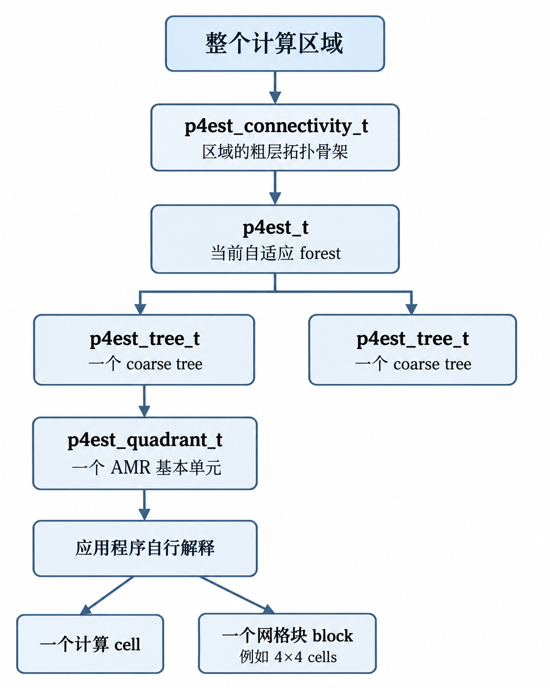
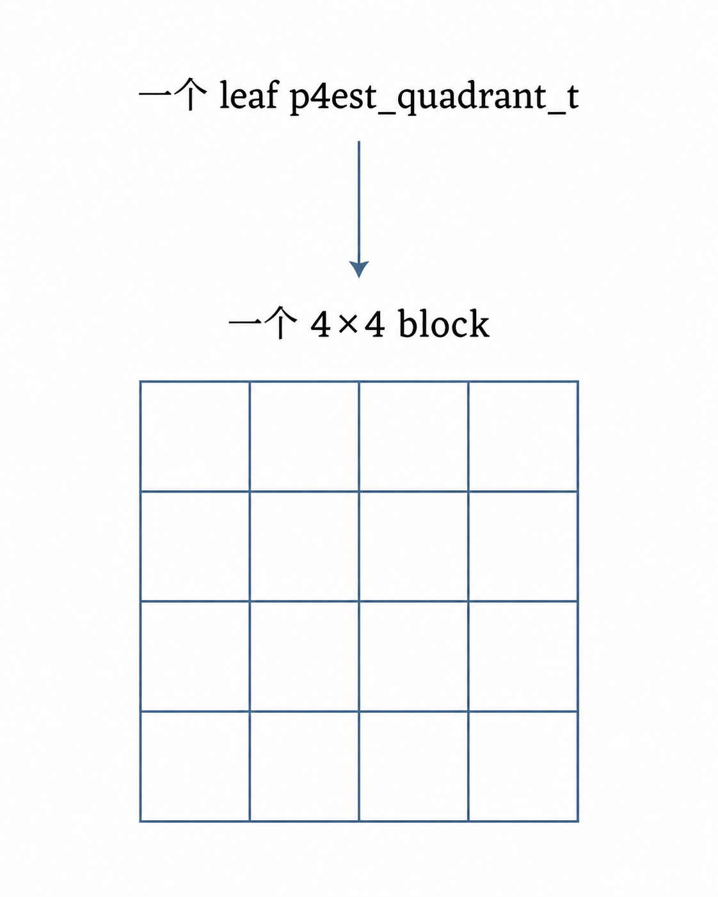
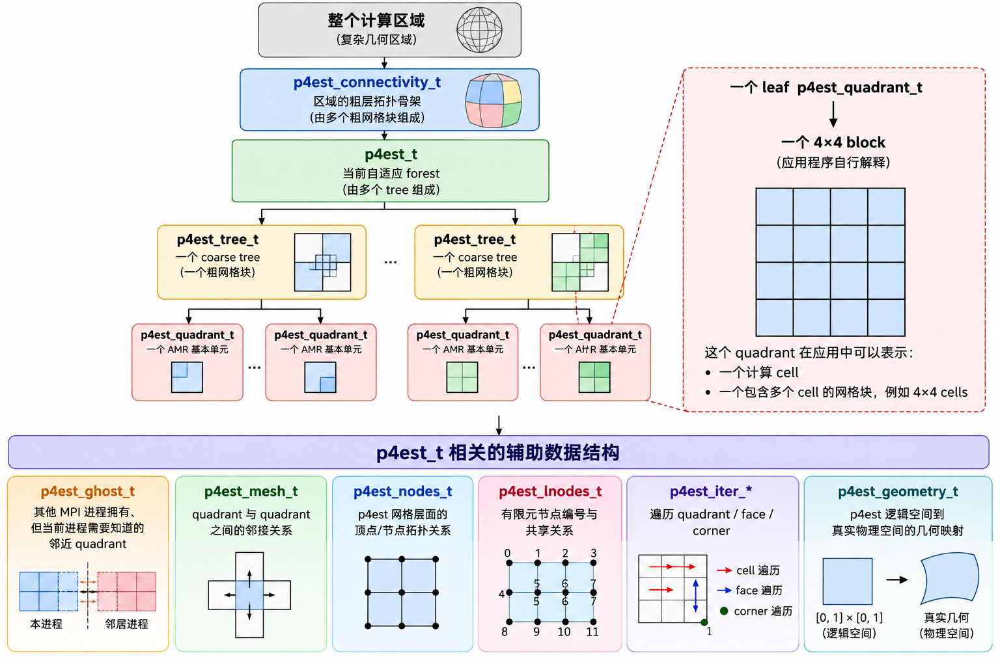

# 笛卡尔网格-八叉树自适应细化

以 p4est-2.8.7 源码为例，总结基于笛卡尔网格的**八叉树自适应细化**和**负载均衡**相关技术。

## p4est 设计架构

p4est/p8est 的核心数据模型从 `coarse mesh` 开始：多个 `coarse trees` 通过 `connectivity` 连接形成 `coarse mesh`，由 `p4est_connectivity_t` / `p8est_connectivity_t` 描述；在该 `coarse mesh` 上建立分布式自适应 `forest`，由 `p4est_t` / `p8est_t` 管理；每个 `coarse tree` 的当前 AMR 状态由 `p4est_tree_t` / `p8est_tree_t` 表示，其中保存按 Morton 顺序组织的 `leaf quadrants` / `leaf octants`；单个 leaf 单元由 `p4est_quadrant_t` / `p8est_quadrant_t` 描述。所有 leaf 单元进一步按照 space-filling curve 划分到多个 MPI processes，并通过 `ghost`、`mesh` 等派生结构支持跨进程通信和邻接查询。

p4est 的核心结构层次关系是：



> **注意**：一个叶子象限 `p4est_quadrant_t` 是 p4est 管理的基本 AMR 单元，但它不一定必须对应一个数值计算中的 cell。根据应用程序的设计，一个 leaf quadrant 可以：
>
> - 对应一个计算 cell；
> - 也可以对应一个包含多个计算 cell 的网格块，例如 `4×4`、`8×8` 的 block/patch。
>
> 例如采用 block-based 方法时：
>
> 
>
> 这时 p4est 只管理这个 block 整体，而不知道 block 内部存在 16 个计算 cell。

在这条主线旁边，还有几套辅助信息：



## 核心数据结构

### pXest_connectivity_t

#### 二维 `p4est_connectivity_t`

表示二维四叉树森林中所有**根树之间的连接关系**及其**几何位置信息**，即描述多个根树如何通过面和角点相互连接，以及各根树在物理空间中的几何嵌入关系。它刻画的是四叉树森林在尚未进行自适应细化时的粗层级静态拓扑与几何信息，不包含细化后产生的叶子象限状态，也不涉及 MPI 进程划分。

该数据结构主要包含五类信息：<u>基本规模信息</u>、<u>几何信息</u>、<u>面连接拓扑信息</u>、<u>点连接拓扑信息</u>、<u>用户自定义属性信息</u>。

##### 基本规模信息

> **数据成员：`p4est_topidx_t num_vertices`**
>
> 整数标量，用于存储粗网格中用于根树几何嵌入的顶点数量。该值决定 `vertices` 数组的规模，其中 `vertices` 的长度为 `3 × num_vertices`。这些顶点仅用于描述根树的几何位置，不参与根树之间拓扑连接关系的确定。

> **数据成员：`p4est_topidx_t num_trees`**
>
> 整数标量，用于存储粗网格中根树的总数量。该值决定所有按根树组织的数据结构规模，例如 `tree_to_vertex`、`tree_to_tree`、`tree_to_face` 和 `tree_to_corner` 等数组的长度均与 `num_trees` 成正比。

> **数据成员：`p4est_topidx_t num_corners`**
>
> 整数标量，用于存储粗网格中需要显式描述的角点拓扑连接关系数量。当若干个根树的局部角点在拓扑上连接于同一个角点位置，且这种连接关系不能仅通过已有的面连接关系确定时，p4est 会将其作为一个显式角点拓扑连接关系进行记录。该值用于确定 `ctt_offset` 等角点连接数据结构的规模。    

##### 几何信息

> **数据成员：`double *vertices`**
>
> **`double \*vertices`**。指向一段连续 `double` 数组的指针，用于存储粗网格中所有用于根树几何嵌入的顶点三维坐标信息。数组长度为 `3 × num_vertices`，顶点 `i` 的 `x`、`y`、`z` 坐标分别存储在 `vertices[3*i]`、`vertices[3*i+1]` 和 `vertices[3*i+2]` 中。该数组仅用于描述根树的几何位置，不参与根树之间拓扑连接关系的确定。

> **数据成员：`p4est_topidx_t *tree_to_vertex`**
>
> 指向一段连续整数数组的指针，用于存储每棵根树的 4 个局部角点分别对应哪个几何顶点。数组长度为 `4 × num_trees`，根树 `i` 的局部角点 `j` 对应的几何顶点编号存储在 `tree_to_vertex[4*i+j]` 中，其中 `j = 0,1,2,3`。局部角点按照 `yx = 00, 01, 10, 11` 的 Z-order 顺序编号，即：
>
> ```c
> corner 0 = (x=0, y=0)
> corner 1 = (x=1, y=0)
> corner 2 = (x=0, y=1)
> corner 3 = (x=1, y=1)
> ```
>
> 因此，`tree_to_vertex[4*i+j]` 给出根树 `i` 的局部角点 `j` 所对应的几何顶点编号，该编号可进一步用于索引 `vertices` 获取对应顶点的三维坐标。该数组用于描述根树的几何嵌入关系，不参与根树之间拓扑连接关系的确定。

##### 面连接拓扑信息

> **数据成员：`p4est_topidx_t *tree_to_tree`**
>
> 指向一段连续整数数组的指针，用于存储每棵根树的 4 个局部面分别与哪一棵根树相邻。数组长度为 `4 × num_trees`，根树 `i` 的局部面 `f` 对应的相邻根树编号存储在 `tree_to_tree[4*i+f]` 中，其中 `f = 0,1,2,3`。局部面的编号顺序为：
>
> ```c
> face 0 = -x
> face 1 = +x
> face 2 = -y
> face 3 = +y
> ```
>
> 因此：
>
> ```c
> tree_to_tree[4*i+0] → 根树 i 的 -x 面相邻的根树编号
> tree_to_tree[4*i+1] → 根树 i 的 +x 面相邻的根树编号
> tree_to_tree[4*i+2] → 根树 i 的 -y 面相邻的根树编号
> tree_to_tree[4*i+3] → 根树 i 的 +y 面相邻的根树编号
> ```
>
> 如果某个面位于物理边界，源码规定该面必须连接到自身，即：
>
> ```c
> tree_to_tree[4*i+f] = i;
> ```
>
> `tree_to_tree` 只用于确定**相邻的是哪一棵根树**；相邻根树具体通过哪个局部面与当前面连接，以及两个面的方向关系，需要结合 `tree_to_face` 一起确定。

> **数据成员：`int8_t *tree_to_face`**
>
> 指向一段连续 `int8_t` 数组的指针，用于存储每棵根树的 4 个局部面与相邻根树连接时，对方的**局部面编号**以及两个面的**相对方向信息**。数组长度为 `4 × num_trees`，根树 `i` 的局部面 `f` 对应的编码值存储在：`tree_to_face[4*i+f]`，其中 `f = 0,1,2,3`，局部面的编号顺序为：
>
> ```c
> face 0 = -x
> face 1 = +x
> face 2 = -y
> face 3 = +y
> ```
>
> `tree_to_face[4*i+f]` 的取值范围为 `0~7`。设：`ttf = tree_to_face[4*i+f];` 则：
>
> ```c
> neighbor_face = ttf % 4;
> orientation   = ttf / 4;
> ```
>
> 其中：`neighbor_face = 0,1,2,3` 表示相邻根树中与当前面相连接的局部面编号；`orientation = 0` 表示两个面的自然方向一致；`orientation = 1` 表示两个面的自然方向相反。因此，`tree_to_face` 需要与 `tree_to_tree` 配合使用：
>
> ```c
> tree_to_tree[4*i+f]
>     → 确定相邻的是哪一棵根树
> 
> tree_to_face[4*i+f]
>     → 确定对方的哪个局部面与当前面连接
>       以及两个面的相对方向
> ```

##### 点连接拓扑信息

> **数据成员：`p4est_topidx_t *tree_to_corner`**
>
> 指向一段连续整数数组的指针，用于存储每棵根树的 4 个局部角点是否对应一个需要显式描述的角点拓扑连接关系，以及对应的角点连接编号。数组长度为 `4 × num_trees`，根树 `i` 的局部角点 `j` 对应的值存储在：`tree_to_corner[4*i+j]`，其中 `j = 0,1,2,3`，局部角点按照 `yx = 00, 01, 10, 11` 的 Z-order 顺序编号：
>
> ```c
> corner 0 = (x=0, y=0)
> corner 1 = (x=1, y=0)
> corner 2 = (x=0, y=1)
> corner 3 = (x=1, y=1)
> ```
>
> 如果某个局部角点参与了一个**不能仅通过已有面连接关系确定的角点拓扑连接关系**，则：`tree_to_corner[4*i+j] = c;`，其中 `c` 是角点连接编号，范围为：`0 ~ num_corners - 1`。随后可通过：
>
> ```c
> ctt_offset[c]
> ctt_offset[c+1]
> ```
>
> 找到该角点连接在 `corner_to_tree` 和 `corner_to_corner` 中对应的记录区间。如果该局部角点不需要额外的角点拓扑连接描述，则：`tree_to_corner[4*i+j] = -1;`。

> **数据成员：`p4est_topidx_t *ctt_offset`**
>
> 长度为 `num_corners + 1` 的整数数组，采用**偏移量表（offset table）**的方式，记录每个显式角点拓扑连接在 `corner_to_tree` 和 `corner_to_corner` 两个数组中对应的数据区间。
>
> 对于角点连接编号 `c`：
>
> ```c
> start = ctt_offset[c];
> end   = ctt_offset[c + 1];
> ```
>
> 则：
>
> ```c
> corner_to_tree[start ... end-1]
> corner_to_corner[start ... end-1]
> ```
>
> 共同记录该角点连接所包含的所有 `(根树编号, 局部角点编号)`。该角点连接包含的根树局部角点数量为：`ctt_offset[c + 1] - ctt_offset[c]`。

> **数据成员：`p4est_topidx_t *corner_to_tree`**
>
> 一个一维整数数组，用于连续存储所有显式角点拓扑连接中涉及的**根树编号**。必须结合 `ctt_offset` 来确定每个角点连接对应哪一段数据。

> **数据成员：`int8_t *corner_to_corner`**
>
> 一个一维 8 位整数数组，用于连续存储所有显式角点拓扑连接中，各根树参与连接时所对应的**局部角点编号**。必须结合 `ctt_offset` 来确定每个角点连接对应哪一段数据。

##### 用户自定义属性信息

> **数据成员：`size_t tree_attr_bytes`**
>
> 一个 `size_t` 类型的整数标量，用于存储**每棵根树在 `tree_to_attr` 中占用的用户自定义属性字节数**。所有根树使用相同大小的属性块

> **数据成员：`char *tree_to_attr`**
>
> 一个指向连续字符数组的指针，用于存储**所有根树的用户自定义属性数据**。

#### 三维 `p8est_connectivity_t`

`p8est_connectivity_t` 表示三维八叉树森林中所有**根树之间的连接关系**及其**几何位置信息**，即描述多个根树如何通过面、边和角点相互连接，以及各根树在物理空间中的几何嵌入关系。它刻画的是八叉树森林在尚未进行自适应细化时的粗层级静态拓扑与几何信息，不包含细化后产生的叶子八分体状态，也不涉及 MPI 进程划分。

该数据结构主要包含六类信息：**基本规模信息、几何信息、面连接拓扑信息、边连接拓扑信息、角点连接拓扑信息、用户自定义属性信息。**

##### 基本规模信息

> 数据成员：`p4est_topidx_t num_vertices`

> `p4est_topidx_t    num_trees`

> `p4est_topidx_t    num_edges`

> `p4est_topidx_t    num_corners`

##### 几何信息

> `double       *vertices;`

> `p4est_topidx_t   *tree_to_vertex`

##### 面连接拓扑信息

> `p4est_topidx_t   *tree_to_tree`

> `int8_t       *tree_to_face`


##### 边连接拓扑信息

> `p4est_topidx_t   *tree_to_edge`

> `p4est_topidx_t   *ett_offset`

> `p4est_topidx_t   *edge_to_tree`

> `int8_t       *edge_to_edge`

##### 角点连接拓扑信息

> `p4est_topidx_t   *tree_to_corner`

> `p4est_topidx_t   *ctt_offset`

> `p4est_topidx_t   *corner_to_tree`

> `int8_t       *corner_to_corner`

##### 用户自定义属性信息

> `size_t        tree_attr_bytes`

> `char        *tree_to_attr`

### pXest_t

#### 二维情况

```c
/** The p4est forest datatype */
typedef struct p4est
{
  sc_MPI_Comm         mpicomm;          /**< MPI communicator */
  int                 mpisize,          /**< number of MPI processes */
                      mpirank;          /**< this process's MPI rank */
  int                 mpicomm_owned;    /**< flag if communicator is owned */
  size_t              data_size;        /**< size of per-quadrant p.user_data
                     (see p4est_quadrant_t::p4est_quadrant_data::user_data) */
  void               *user_pointer;     /**< convenience pointer for users,
                                             never touched by p4est */

  long                revision;         /**< Gets bumped on mesh change */
  p4est_topidx_t      first_local_tree; /**< 0-based index of first local
                                             tree, must be -1 for an empty
                                             processor */
  p4est_topidx_t      last_local_tree;  /**< 0-based index of last local
                                             tree, must be -2 for an empty
                                             processor */
  p4est_locidx_t      local_num_quadrants;   /**< number of quadrants on all
                                                  trees on this processor */
  p4est_gloidx_t      global_num_quadrants;  /**< number of quadrants on all
                                                  trees on all processors */
  p4est_gloidx_t     *global_first_quadrant; /**< first global quadrant index
                                                  for each process and 1
                                                  beyond */
  p4est_quadrant_t   *global_first_position; /**< first smallest possible quad
                                                  for each process and 1
                                                  beyond */
  p4est_connectivity_t *connectivity; /**< connectivity structure, not owned */
  sc_array_t         *trees;          /**< array of all trees */

  sc_mempool_t       *user_data_pool; /**< memory allocator for user data */
  /*   WARNING: This is NULL if data size
     equals zero. */
  sc_mempool_t       *quadrant_pool;  /**< memory allocator for temporary
                                           quadrants */
  p4est_inspect_t    *inspect;        /**< algorithmic switches */
}
p4est_t;
```

`p4est_t` 描述的是建立在 `connectivity` 上的 **并行自适应树森林状态**。

> `size_t data_size;` 
>
> 一个 `size_t` 整数，表示每一个 quadrant 的 `p.user_data` 占多少字节。

> `void *user_pointer;`
>
> 一个通用指针，指向**整个 forest 级别的用户自定义上下文数据**。p4est 不解释该指针指向的数据内容。

> `long revision;`
>
> 一个整数计数器，表示当前 forest 的版本号。新创建的 forest 从 0 开始，当 mesh 真正发生变化时递增。

> `p4est_topidx_t first_local_tree;`
>
> 一个整数，存储当前 MPI rank 拥有 leaf quadrants 的第一棵 coarse tree 的编号。

>  `p4est_topidx_t last_local_tree;`
>
> 一个整数，存储当前 MPI rank 拥有 leaf quadrants 的最后一棵 coarse tree 的编号。

> `p4est_locidx_t local_num_quadrants;`
>
> 一个本地整数，表示当前 MPI rank 实际拥有的所有 leaf quadrants 的总数量。

> `p4est_gloidx_t global_num_quadrants;`
>
> 一个全局整数，表示所有 MPI process 上 leaf quadrants 的总数量。

> `p4est_gloidx_t *global_first_quadrant;`
>
> 一个长度为 `mpisize + 1` 的一维连续整数数组，以 prefix-sum / offset 的形式存储每个 MPI rank 在全局 quadrant 序列中的起始索引。

> `p4est_quadrant_t *global_first_position;`
>
> 一个长度为 `mpisize + 1` 的 `p4est_quadrant_t` 数组，用 quadrant-like 的位置表示每个 MPI rank 在整个 forest 空间 / Morton 顺序中的 partition 起始位置。

> `p4est_connectivity_t *connectivity;`
>
> 一个指针，指向创建当前 forest 所依赖的 `p4est_connectivity_t`，即 coarse tree 的几何和拓扑结构。

> `sc_array_t *trees;`
>
> 一个 `sc_array_t` 动态数组，数组中的每个元素是一个 `p4est_tree_t`，数组长度等于 `connectivity->num_trees`。

> `sc_mempool_t *user_data_pool;`
>
> 一个内存池对象，用于统一分配和回收每个 quadrant 的 `p.user_data`。

> `sc_mempool_t *quadrant_pool;`
>
> 一个 `sc_mempool_t` 内存池，用于 p4est 内部算法执行过程中创建和回收临时 `p4est_quadrant_t` 对象。

> `p4est_inspect_t *inspect;`
>
> 一个指向 `p4est_inspect_t` 的指针，用于保存部分内部算法的控制开关、计数器和性能统计信息。

#### 三维情况


### pXest_tree_t

#### 二维情况

```c
/** The p4est tree datatype */
typedef struct p4est_tree
{
  sc_array_t          quadrants;             /**< locally stored quadrants */
  p4est_quadrant_t    first_desc,            /**< first local descendant */
                      last_desc;             /**< last local descendant */
  p4est_locidx_t      quadrants_offset;      /**< cumulative sum over earlier
                                                  trees on this processor
                                                  (locals only) */
  p4est_locidx_t      quadrants_per_level[P4EST_MAXLEVEL + 1];
                                             /**< locals only */
  int8_t              maxlevel;              /**< highest local quadrant level */
}
p4est_tree_t;
```

一个 `p4est_tree_t` 对应 connectivity 中的一棵 coarse tree，但这里保存的不是 coarse tree 的几何拓扑，而是**当前 MPI rank 在这棵 tree 上拥有的 leaf quadrants 及其统计信息**。

> `sc_array_t quadrants;`
>
> 一个 `sc_array_t` 动态数组，数组元素类型为 `p4est_quadrant_t`，用于连续存储当前 MPI rank 在这棵 coarse tree 上拥有的所有 leaf quadrants。quadrants 的排列顺序按照**Morton / Z-order** 排列。`quadrants` 本质上是当前 MPI rank 在该 tree 上拥有的一段有序 leaf-quadrant 序列。

> `p4est_quadrant_t first_desc;`
>
> 一个 `p4est_quadrant_t`，保存当前 tree 中**第一个本地 leaf quadrant 的最小 descendant**，这个 descendant 被统一细化到 `P4EST_QMAXLEVEL`。 `first_desc` 的作用不是保存一个实际 leaf，而是：精确表示当前 MPI rank 在这棵 tree 上所覆盖 Morton 区间的左端点。

> `p4est_quadrant_t last_desc;`
>
> 一个 `p4est_quadrant_t`，保存当前 tree 中**最后一个本地 leaf quadrant 的最大 descendant**，同样统一到 `P4EST_QMAXLEVEL`。

> `p4est_locidx_t quadrants_offset;`
>
> 一个本地整数，存储当前 tree 的第一个 local quadrant 在“当前 MPI rank 所有 local quadrants”中的起始编号。

> `p4est_locidx_t quadrants_per_level[P4EST_MAXLEVEL + 1];`
>
> 一个固定长度整数数组，下标表示 refinement level，数组值表示当前 MPI rank 在这棵 tree 上该 level 有多少个 leaf quadrants。

> `int8_t maxlevel;`
>
> 一个 8 位整数，存储当前 MPI rank 在这棵 tree 上拥有的 leaf quadrants 中最高的 refinement level。


#### 三维情况


### pXest_quadrant_t

#### 二维情况

```c
/** The 2D quadrant datatype */
typedef struct p4est_quadrant
{
  /*@{ */
  p4est_qcoord_t      x, y;  /**< coordinates */
  /*@} */
  int8_t              level,    /**< level of refinement */
                      pad8;     /**< padding */
  int16_t             pad16;    /**< padding */
  /** Union for quadrant data.
   *
   * It is important to notice that \ref piggy1 and \ref piggy2 are only used
   * internally. Hence, they are not part of the API.
   *
   * Usually \ref piggy3 is also not part of the API. The only exception holds
   * for quadrants in the [ghosts](\ref p4est_ghost_t::ghosts) array of
   * p4est_ghost_t (cf. documentation of [ghosts](\ref p4est_ghost_t::ghosts)).
   */
  union p4est_quadrant_data
  {
    void               *user_data;      /**< never changed by p4est */
    long                user_long;      /**< never changed by p4est */
    int                 user_int;       /**< never changed by p4est */
    p4est_topidx_t      which_tree;     /**< the tree containing the quadrant
                                             (used in auxiliary octants such
                                             as the ghost octants in
                                             p4est_ghost_t) */
    struct
    {
      p4est_topidx_t      which_tree;
      int                 owner_rank;
    }
    piggy1; /**< of ghost octants, store the tree and owner rank; not part of
                 the API */
    struct
    {
      p4est_topidx_t      which_tree;
      p4est_topidx_t      from_tree;
    }
    piggy2; /**< of transformed octants, store the original tree and the
                 target tree; not part of the API */
    struct
    {
      p4est_topidx_t      which_tree;
      p4est_locidx_t      local_num;
    }
    piggy3; /**< of ghost octants, store the tree and index in the owner's
                 numbering; only part of the API in \ref p4est_ghost_t::ghosts */
  }
  p; /**< a union of additional data attached to a quadrant */
}
p4est_quadrant_t;
```

`p4est_quadrant_t` 是 p4est 中最基本的空间对象。可以先把它理解成：描述 quadtree 中一个 quadrant 的“**逻辑位置** + **细化层级** + **附加数据**”。结构本身并不存真实物理坐标，也不存四个顶点坐标。它主要通过`x, y, level` 确定这个 quadrant 在某棵 coarse tree 的逻辑空间中的位置和大小。

> `p4est_qcoord_t x, y;`
>
> 整数类型的逻辑坐标，表示 quadrant 在所属 coarse tree 的逻辑坐标系中的 (x, y) 坐标。注意不是物理坐标而是逻辑坐标。x，y 是在一个固定整数坐标空间中表示所有细化级别，概念上可以理解成：
>
> ```markdown
> root tree
> 
> (0,ROOT_LEN)
>     +----------------+
>     |                |
>     |                |
>     |                |
>     +----------------+
> (0,0)            (ROOT_LEN,0)
> ```
>
> 根 tree 的逻辑边长由`P4EST_ROOT_LEN`表示，某个 level 的 quadrant 边长由`P4EST_QUADRANT_LEN(level)`表示。

> `int8_t level;`
>
> 一个 8 位整数，表示这个 quadrant 当前位于 quadtree 的第几层，也就是 refinement level。

> `int8_t pad8; int16_t pad16;` 
>
> 填充字段，主要用于结构体内存布局和对齐。

> `union p4est_quadrant_data;`
>
> `user_data` `user_long` `user_int` `which_tree` `piggy1` `piggy2` `piggy3`  这些成员共用同一块内存，在不同场景下用不同方式解释这块内存。
>
> `void *user_data;` 一个指针，用于指向这个 quadrant 对应的用户自定义数据。
>
> `long user_long;` 与 `user_data` 共用同一块 union 内存，可以把这块附加数据直接解释为一个 `long` 整数。
>
> `int user_int;` 与前面相同，将 union 中的附加数据解释为一个 `int`。
>
> `p4est_topidx_t which_tree;` 将 union 中的附加空间解释为一个 tree ID，表示这个 quadrant 属于哪棵 coarse tree。
>
> `struct { p4est_topidx_t which_tree; int owner_rank; } piggy1;` 一个内部辅助结构，把 union 空间解释为两个字段：which_tree 和 owner_rank。
>
> `struct { p4est_topidx_t which_tree; p4est_topidx_t from_tree; } piggy2;` 它主要用于跨 tree 坐标变换后的临时 quadrant。
>
> `struct { p4est_topidx_t which_tree; p4est_locidx_t local_num; } piggy3;`quadrant 属于哪棵 coarse tree 以及 quadrant 在它真正的 owner rank 上的 local quadrant 编号。


#### 三维情况


### pXest_ghost_t

#### 二维情况

```c
/** Quadrants that neighbor the local domain.
 *
 * See also the page \ref ghost for general information.
 */
typedef struct p4est_ghost
{
  int                 mpisize; /**< MPI size of the ghost */
  p4est_topidx_t      num_trees; /**< number of trees of the ghost */
  p4est_connect_type_t btype; /**< which neighbors are in the ghost layer */

  /** An array of \ref p4est_quadrant_t quadrants which make up the ghost layer
   * around \b p4est.  Their piggy3 (cf. \ref
   * p4est_quadrant::p4est_quadrant_data) data member is filled with their
   * owner's tree and local number (cumulative over trees).  Quadrants are
   * ordered in \ref p4est_quadrant_compare_piggy order. These are quadrants
   * inside the neighboring tree, i.e., \c p4est_quadrant_is_inside is true for
   * the quadrant and the neighboring tree.
   */
  sc_array_t          ghosts;
  p4est_locidx_t     *tree_offsets;     /**< num_trees + 1 ghost indices */
  p4est_locidx_t     *proc_offsets;     /**< mpisize + 1 ghost indices */

  /** An array of local quadrants that touch the parallel boundary from the
   * inside, i.e., that are ghosts in the perspective of at least one other
   * processor.  The storage convention is the same as for \c ghosts above.
   */
  sc_array_t          mirrors;
  p4est_locidx_t     *mirror_tree_offsets;      /**< num_trees + 1 mirror indices */
  p4est_locidx_t     *mirror_proc_mirrors;      /**< indices into mirrors grouped by
                                                   outside processor rank and
                                                   ascending within each rank */
  p4est_locidx_t     *mirror_proc_offsets;      /**< mpisize + 1 indices into 
                                                   mirror_proc_mirrors */
  p4est_locidx_t     *mirror_proc_fronts;       /**< like mirror_proc_mirrors,
                                                   but limited to the
                                                   outermost octants.  This is
                                                   NULL until
                                                   p4est_ghost_expand is
                                                   called */
  p4est_locidx_t     *mirror_proc_front_offsets;        /**< NULL until
                                                           p4est_ghost_expand is
                                                           called */
}
p4est_ghost_t;
```

`p4est_ghost_t` 可以理解为：**描述当前 MPI rank 与其他 MPI rank 之间的“网格边界关系”。**它同时保存两套互为对偶的数据：

- ghosts：别人拥有、但我计算时需要知道的 quadrants
- mirrors：我拥有、但别人计算时需要知道的 quadrants

> `p4est_topidx_t num_trees; /**< number of trees of the ghost */`
>
> `num_trees` 采用一个整数标量存储，保存该 `p4est_ghost_t` 所对应的 coarse tree 总数；在正常创建过程中等于 `p4est->connectivity->num_trees`。它不是“实际包含 ghost quadrant 的 tree 数量”，而是后续 `tree_offsets`、`mirror_tree_offsets` 等按 tree 建立索引时使用的 tree 总数。

> `p4est_connect_type_t btype; /**< which neighbors are in the ghost layer */`
>
> `btype` 采用一个 `p4est_connect_type_t` 枚举标量存储，保存该 ghost layer 使用的邻接类型，决定哪些跨 MPI 边界的 quadrant 被视为 ghost 邻居。在二维中，`P4EST_CONNECT_FACE` 表示只考虑共享面的邻居，`P4EST_CONNECT_CORNER` 表示同时考虑共享面和仅共享角点的邻居。

> `sc_array_t ghosts;`
>
> `ghosts` 采用一个元素类型为 `p4est_quadrant_t` 的连续动态数组存储，保存当前 MPI rank 周围由其他 MPI rank 拥有的 ghost quadrants。每个元素通过 `x、y、level` 保存 quadrant 在所属 tree 中的位置和层级，并通过 `p.piggy3.which_tree` 和 `p.piggy3.local_num` 保存其所属 coarse tree 以及它在 owner rank 上的本地编号。

> `p4est_locidx_t   *tree_offsets;   /**< num_trees + 1 ghost indices */`
>
> `tree_offsets` 采用一个长度为 `num_trees + 1` 的连续整数 offset 数组存储。它不存 ghost quadrant 本身，而是存每棵 coarse tree 在 `ghosts` 数组中的起始下标；tree `t` 对应的 ghost quadrants 位于 `ghosts[tree_offsets[t] : tree_offsets[t+1])`，两个相邻 offset 的差值就是该 tree 上的 ghost 数量。

> `p4est_locidx_t   *proc_offsets;   /**< mpisize + 1 ghost indices */`
>
> `proc_offsets` 采用一个长度为 `mpisize + 1` 的连续整数 offset 数组存储，用来按照 **owner MPI rank** 划分 `ghosts` 数组。对于进程 `p`，`ghosts[proc_offsets[p] : proc_offsets[p+1])` 中的所有 quadrant 都真正属于 MPI rank `p`；两个相邻 offset 的差值表示当前进程拥有多少个来自 rank `p` 的 ghost quadrants。

> `tree_offsets` 和 `proc_offsets` 的联系
>
> 在 p4est 中，`ghosts` 按全局 forest 顺序存储，即首先按 coarse tree 编号、同一 tree 内再按 Morton/Z-order 排列；由于 p4est 将这一全局顺序连续地划分给递增的 MPI rank，因此 `ghosts` 中 ghost 的 owner MPI rank 也呈非递减顺序。`tree_offsets` 和 `proc_offsets` 正是对同一个有序 `ghosts` 数组从 tree 和 owner rank 两个维度建立的区间索引。

> `sc_array_t mirrors;`
>
> `mirrors` 采用一个元素类型为 `p4est_quadrant_t` 的连续动态数组存储，保存当前 MPI rank 自己拥有、位于并行边界内侧、并且会作为至少一个其他 MPI rank 的 ghost 的 local quadrants。每个 mirror 通过 `x、y、level` 保存其逻辑位置和层级，并通过 `p.piggy3.which_tree` 和 `p.piggy3.local_num` 保存所属 coarse tree 以及它在当前 rank 上的统一本地 quadrant 编号。它保存的是 quadrant 的轻量描述副本，而不是用户数据的独立副本。

> `p4est_locidx_t *mirror_tree_offsets;    /**< num_trees + 1 mirror indices */`
>
> `mirror_tree_offsets` 采用一个长度为 `num_trees + 1` 的连续整数 offset 数组存储，用于按 coarse tree 划分 `mirrors` 数组。对于 tree `t`，`mirrors[mirror_tree_offsets[t] : mirror_tree_offsets[t+1])` 中保存当前 rank 在该 tree 上所有作为其他进程 ghost 的 local mirror quadrants；相邻两个 offset 的差值就是该 tree 上的 mirror 数量。

> `p4est_locidx_t *mirror_proc_mirrors;`    
>
> `/**< indices into mirrors grouped by outside processor rank and ascending within each rank */`
>
> `mirror_proc_mirrors` 采用一个连续整数索引数组存储，其每个元素都是 `mirrors` 数组中的下标。它按照外部 MPI rank 分组，记录每个其他进程需要当前进程的哪些 mirror quadrants；同一个 mirror 如果被多个 MPI rank 需要，其下标可以在不同 rank 的分组中重复出现。每个 rank 分组内部的 mirror 下标按照升序排列。该数组必须结合 `mirror_proc_offsets` 才能确定每一段索引分别属于哪个 MPI rank。

> `p4est_locidx_t *mirror_proc_offsets;    /**< mpisize + 1 indices into mirror_proc_mirrors */`
>
> `mirror_proc_offsets` 采用一个长度为 `mpisize + 1` 的连续整数 offset 数组存储，用于按外部 MPI rank 划分 `mirror_proc_mirrors`。对于 rank `p`，`mirror_proc_mirrors[mirror_proc_offsets[p] : mirror_proc_offsets[p+1])` 中保存该 rank 需要的所有 `mirrors` 下标；相邻两个 offset 的差值表示当前进程需要向该 rank 提供多少个 mirror quadrants。

#### 三维情况


### pXest_mesh_t

#### 二维情况

```c
/** This structure contains complete mesh information on a 2:1 balanced forest.
 * It stores the locally relevant neighborhood, that is, all locally owned
 * quadrants and one layer of adjacent ghost quadrants and their owners.
 *
 * For each local quadrant, its tree number is stored in quad_to_tree.
 * The quad_to_tree array is NULL by default and can be enabled using
 * \ref p4est_mesh_new_ext or \ref p4est_mesh_new_params.
 * For each ghost quadrant, its owner rank is stored in ghost_to_proc.
 * For each level, an array of local quadrant numbers is stored in quad_level.
 * The quad_level array is NULL by default and can be enabled using
 * \ref p4est_mesh_new_ext or \ref p4est_mesh_new_params.
 *
 * The quad_to_quad list stores one value for each local quadrant's face.
 * This value is in 0..local_num_quadrants-1 for local quadrants, or in
 * local_num_quadrants + (0..ghost_num_quadrants-1) for ghost quadrants.
 *
 * The quad_to_face list has equally many entries that are either:
 * 1. A value of v = 0..7 indicates one same-size neighbor.
 *    This value is decoded as v = r * 4 + nf, where nf = 0..3 is the
 *    neighbor's connecting face number and r = 0..1 is the relative
 *    orientation of the neighbor's face; see p4est_connectivity.h.
 * 2. A value of v = 8..23 indicates a double-size neighbor.
 *    This value is decoded as v = 8 + h * 8 + r * 4 + nf, where
 *    r and nf are as above and h = 0..1 is the number of the subface.
 *    h designates the subface of the large neighbor that the quadrant
 *    touches (this is the same as the large neighbor's face corner).
 * 3. A value of v = -8..-1 indicates two half-size neighbors.
 *    In this case the corresponding quad_to_quad index points into the
 *    quad_to_half array that stores two quadrant numbers per index,
 *    and the orientation of the smaller faces follows from 8 + v.
 *    The entries of quad_to_half encode between local and ghost quadrant
 *    in the same way as the quad_to_quad values described above.
 *    The small neighbors in quad_to_half are stored in the sequence
 *    of the face corners of this, i.e., the large quadrant.
 *
 * A quadrant on the boundary of the forest sees itself and its face number.
 *
 * The quad_to_corner list stores corner neighbors that are not face neighbors.
 * On the inside of a tree, there is precisely one such neighbor per corner.
 * In this case, its index is encoded as described above for quad_to_quad.
 * The neighbor's matching corner number is always diagonally opposite,
 * that is, corner number ^ 3.
 *
 * On the inside of an inter-tree face, we have precisely one corner neighbor.
 * If a corner is an inter-tree corner, then the number of corner neighbors
 * may be any non-negative number.  In both cases, the quad_to_corner value
 * is in
 *    local_num_quadrants + local_num_ghosts + [0 .. local_num_corners - 1].
 * After subtracting the number of local and ghost quadrants,
 * it indexes into corner_offset, which encodes a group of corner neighbors.
 * Each group contains the quadrant numbers encoded as usual for quad_to_quad
 * in corner_quad, and the corner number from the neighbor as corner_corner.
 *
 * Corners with no diagonal neighbor at all are assigned the value -3.  This
 * only happens on the domain boundary, which is necessarily a tree boundary.
 * Corner-neighbors for hanging nodes are assigned the value -1.
 *
 * The params struct describes the parameters the mesh was created with.
 * For full control over the parameters, use \ref p8est_mesh_new_params for
 * mesh creation.
 */
typedef struct
{
  p4est_locidx_t      local_num_quadrants; /**< number of process-local quadrants */
  p4est_locidx_t      ghost_num_quadrants; /**< number of ghost-layer quadrants */

  p4est_topidx_t     *quad_to_tree;     /**< tree index for each local quad.
                                             Is NULL if compute_tree_index in
                                             params is 0. */
  int                *ghost_to_proc;    /**< processor for each ghost quad */

  p4est_locidx_t     *quad_to_quad;     /**< one index for each of the 4 faces */
  int8_t             *quad_to_face;     /**< encodes orientation/2:1 status */
  sc_array_t         *quad_to_half;     /**< stores half-size neighbors */

  sc_array_t         *quad_level;       /**< Stores lists of per-level quads.
                                             The array has entries indexed by
                                             0..P4EST_QMAXLEVEL inclusive that
                                             are arrays of local quadrant ids.
                                             Is NULL if compute_level_lists in
                                             params is 0. */

  /* These members are NULL if btype in params is < P8EST_CONNECT_CORNER and can
   * be requested in \ref p4est_mesh_new. */
  p4est_locidx_t      local_num_corners;        /**< tree-boundary corners */
  p4est_locidx_t     *quad_to_corner;   /**< 4 indices for each local quad */
  sc_array_t         *corner_offset;    /**< local_num_corners + 1 entries */
  sc_array_t         *corner_quad;      /**< corner_offset indexes into this */
  sc_array_t         *corner_corner;    /**< and this one too (type int8_t) */

  p4est_mesh_params_t params;           /**< parameters the mesh was created
                                             with, e.g. by passing them to
                                             \ref p4est_mesh_new_ext or
                                             \ref p4est_mesh_new_params */
}
p4est_mesh_t;
```

把 `p4est_t` 中的 local quadrants 和 `p4est_ghost_t` 中的一层 ghost quadrants，组织成可以直接查询的 face/corner 邻接表。

> `p4est_locidx_t local_num_quadrants; /**< number of process-local quadrants */`
>
> `local_num_quadrants` 采用一个 `p4est_locidx_t` 整数标量存储，保存当前 MPI rank 本地拥有的 leaf quadrant 总数；同时它定义了 `p4est_mesh_t` 中 local quadrant 编号空间的长度，并作为 local/ghost 统一编号时的分界值。

> `p4est_locidx_t ghost_num_quadrants; /**< number of ghost-layer quadrants */`
>
> `ghost_num_quadrants` 采用一个 `p4est_locidx_t` 整数标量存储，保存当前 mesh 所引用的 ghost layer 中 ghost quadrants 的总数量；该值等于 `ghost->ghosts.elem_count`，并与 `local_num_quadrants` 一起确定 mesh 中 local/ghost quadrant 的统一编号范围。

> `p4est_topidx_t   *quad_to_tree;`   
>
> `/**< tree index for each local quad. Is NULL if compute_tree_index in params is 0. */`
>
> `quad_to_tree` 采用一个长度为 `local_num_quadrants` 的连续整数数组存储，每个元素保存对应 local quadrant 的 coarse tree 编号，即 `quad_to_tree[qid]` 表示本地编号为 `qid` 的 quadrant 属于哪棵 tree。该数组是可选的，当 `params.compute_tree_index == 0` 时为 `NULL`，启用后主要用于避免每次通过 `p4est->trees` 和 `quadrants_offset` 反查所属 tree。

> `int *ghost_to_proc;   /**< processor for each ghost quad */`
>
> `ghost_to_proc` 采用一个长度为 `ghost_num_quadrants` 的连续 `int` 数组存储，每个元素保存对应 ghost quadrant 的 owner MPI rank，即 `ghost_to_proc[g]` 表示 `ghosts[g]` 真正属于哪个 MPI 进程。它相当于把 `p4est_ghost_t::proc_offsets` 中按进程分段的 ownership 信息展开成逐 ghost 的直接映射。

> `p4est_locidx_t *quad_to_quad;   /**< one index for each of the 4 faces */`
>
> `quad_to_quad` 采用一个长度为 `4 * local_num_quadrants` 的连续整数数组存储，每个 local quadrant 的每个 face 对应一个元素。对于同尺寸邻居或更大的邻居，该值直接保存邻居的 local/ghost 统一 quadrant 编号；对于两个 half-size 小邻居的情况，该值改为保存 `quad_to_half` 中对应双邻居记录的索引。因此 `quad_to_quad` 必须结合 `quad_to_face` 才能正确解释。

> `int8_t *quad_to_face;   /**< encodes orientation/2:1 status */`
>
> `quad_to_face` 采用一个长度为 `4 * local_num_quadrants` 的连续 `int8_t` 数组存储，每个 local quadrant 的每个 face 对应一个编码值。该值用于编码邻居与当前 quadrant 的 2:1 尺寸关系、邻居的连接 face 编号和 face 相对方向；当邻居比当前 quadrant 大一层时，还额外编码当前 quadrant 接触大邻居 face 的哪个 subface。它必须和同位置的 `quad_to_quad` 一起解释。

> `sc_array_t *quad_to_half;   /**< stores half-size neighbors */`
>
> `quad_to_half` 采用一个 `sc_array_t` 动态数组存储，每个元素包含两个 `p4est_locidx_t`，用于保存某个大 local quadrant 的一个 face 对应的两个 half-size 小邻居的统一 quadrant 编号。只有当对应的 `quad_to_face` 为 `-8..-1` 时，`quad_to_quad` 才被解释为 `quad_to_half` 的 element index，而不是直接的邻居 quadrant ID。

> ```c
> sc_array_t         *quad_level;       /**< Stores lists of per-level quads.
>                                              The array has entries indexed by
>                                              0..P4EST_QMAXLEVEL inclusive that
>                                              are arrays of local quadrant ids.
>                                              Is NULL if compute_level_lists in
>                                              params is 0. */
> ```
>
> `quad_level` 采用一个按 level 索引的 `sc_array_t` 数组结构存储，外层索引范围为 `0..P4EST_QMAXLEVEL`，每个元素内部又保存若干 `p4est_locidx_t` 类型的 local quadrant ID，用于记录当前 MPI rank 上属于该 refinement level 的所有 local quadrants。它是一个可选的按层级分类索引，当 `params.compute_level_lists == 0` 时为 `NULL`。

> `p4est_locidx_t local_num_corners;     /**< tree-boundary corners */`
>
> `local_num_corners` 采用一个 `p4est_locidx_t` 整数标量存储，表示当前 mesh 中已经建立的、需要借助 `corner_offset / corner_quad / corner_corner` 额外描述的 corner-neighbor group 数量。它不是 quadrant corner 的总数，也不是几何顶点数量；每调用一次 `mesh_corner_allocate()` 创建一组复杂 corner 邻接关系，该值就增加 1。

> `p4est_locidx_t *quad_to_corner;  /**< 4 indices for each local quad */`
>
> `quad_to_corner` 采用一个长度为 `4 * local_num_quadrants` 的连续 `p4est_locidx_t` 整数数组存储，每个 local quadrant 的每个 corner 对应一个编码值，用于描述那些不是 face neighbor 的 corner-only 邻接关系。在同一 tree 内且只有唯一对角邻居时，该值直接保存 local/ghost quadrant 的统一编号；对于跨 tree 的 corner 邻接，则保存 `local_num_quadrants + ghost_num_quadrants + corner_group_id`，再通过 `corner_offset / corner_quad / corner_corner` 获取一组邻居及其 local corner 编号；`-3` 表示 domain boundary 上没有对角邻居，`-1` 表示 hanging-node corner。

> `sc_array_t *corner_offset;   /**< local_num_corners + 1 entries */`
>
> `corner_offset` 采用一个包含 `local_num_corners + 1` 个 `p4est_locidx_t` 的动态 offset 数组存储，用于按 corner group 划分 `corner_quad` 和 `corner_corner`。对于 corner group `c`，其所有邻居信息位于 `[corner_offset[c], corner_offset[c+1])` 这一段；相邻两个 offset 的差值就是该 corner group 的邻居数量。

> `sc_array_t *corner_quad;    /**< corner_offset indexes into this */`
>
> `corner_quad` 采用一个 `sc_array_t` 一维动态扁平数组存储，数组元素类型为 `p4est_locidx_t`，每个元素保存一个 corner-only neighbor quadrant 的 local/ghost 统一编号。不同 corner group 的邻居记录连续存放，并由 `corner_offset` 划分区间；同一位置的 `corner_corner[i]` 则保存该邻居对应的 local corner 编号。

> `sc_array_t *corner_corner;   /**< and this one too (type int8_t) */`
>
> `corner_corner` 采用一个 `sc_array_t` 一维动态扁平数组存储，元素类型为 `int8_t`；它与 `corner_quad` 等长并按相同下标一一对应。`corner_quad[i]` 保存第 `i` 个 corner-only 邻居 quadrant 的编号，而 `corner_corner[i]` 保存该邻居 quadrant 上与当前 corner 对应的 local corner 编号。不同 corner group 的记录范围由 `corner_offset` 划分。

> ```c
> p4est_mesh_params_t params;           /**< parameters the mesh was created
>                                              with, e.g. by passing them to
>                                              \ref p4est_mesh_new_ext or
>                                              \ref p4est_mesh_new_params */
> ```
>
> `params` 采用一个直接嵌入的 `p4est_mesh_params_t` 结构体对象存储，而不是通过指针引用外部参数。创建 `p4est_mesh_t` 时，源码通过 `mesh->params = *params` 保存一份构造参数副本，其中记录是否生成 `quad_to_tree`、是否生成 `quad_level`，以及 mesh 按 face 还是 corner/full 邻接方式构造。

#### 三维情况


